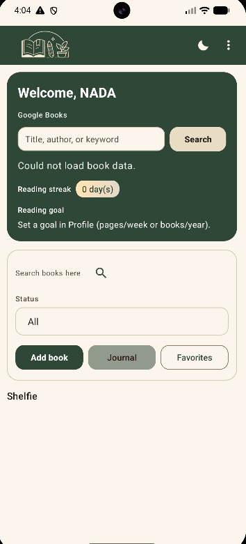
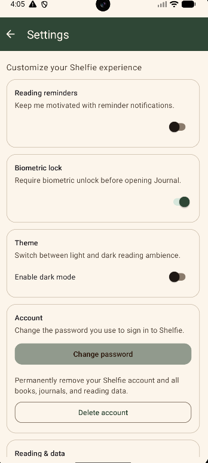
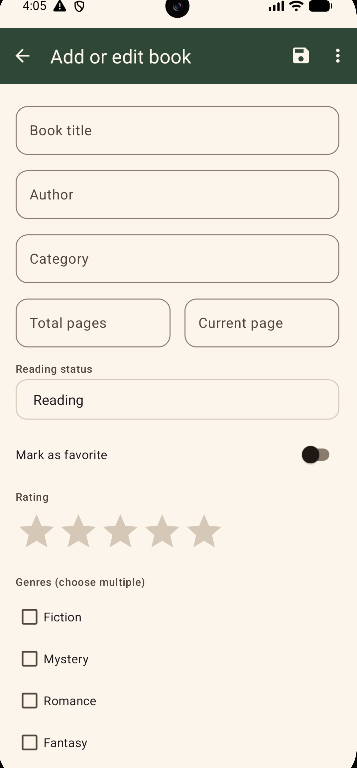

# Shelfie

Shelfie is an Android reading companion app that helps users manage their personal bookshelf, track reading progress, maintain a private reading journal, and view reading statistics.

## Features

* User registration and login
* Personal bookshelf with add, edit, delete, favorite, and reading-status actions
* Google Books search and spotlight integration
* Reading journal with add, edit, delete, and export functionality
* Reading statistics and reading streak tracking
* Daily reading reminders
* Optional biometric or device-credential journal lock
* Light and dark themes
* Profile and account settings
* PHP/MySQL backend API
* Web-based admin dashboard

## Screenshots

### Home



### Settings



### Add a Book



## Tech Stack

**Android**

* Java
* Android Studio
* Android SDK
* AndroidX
* Material Components
* Volley
* Biometric API

**Backend**

* PHP
* MySQL
* XAMPP/Apache

## Repository Structure

```text
Shelfie/
├── android/       # Android application
├── api/           # PHP REST-style API and MySQL schema
├── docs/          # Project documentation
├── screenshots/   # Application screenshots
├── .gitignore
└── README.md
```

## Running the Android App

### 1. Requirements

Install the following:

* Android Studio
* Android SDK
* JDK 11
* XAMPP

### 2. Set Up the API

Copy the `api/` folder into your XAMPP web root, for example:

```text
xampp/htdocs/shelfie_api/
```

Start Apache and MySQL from the XAMPP Control Panel.

Create a MySQL database named:

```text
shelfie_db
```

Import the database schema from:

```text
api/shelfie.sql
```

You can import the SQL file through phpMyAdmin.

Check `api/connection.php` and update the MySQL username and password if necessary.

### 3. Configure the Android App

Open the `android/` folder in Android Studio.

Create `android/local.properties` based on `android/local.properties.example`, if provided.

Configure your Android SDK path and Google Books API key:

```properties
sdk.dir=/path/to/your/Android/sdk
GOOGLE_BOOKS_API_KEY=your_google_books_api_key
```

The `local.properties` file should remain excluded from Git to protect local configuration and API keys.

### 4. Configure the API URL

The Android app uses `ApiConfig.java` to configure the backend URL.

For the Android emulator, use:

```text
http://10.0.2.2:8080/shelfie_api/
```

If Apache runs on a different port, update the URL accordingly.

For a physical Android device, replace `10.0.2.2` with your computer's local network IP address, for example:

```text
http://192.168.x.x:8080/shelfie_api/
```

Ensure that the phone and computer are connected to the same network and that the server is accessible.

### 5. Build and Run

Open the project in Android Studio, allow Gradle to sync, select an emulator or connected Android device, and click **Run**.

## API

The `api/` directory contains the PHP endpoints used by the application, including functionality for authentication, books, journals, profiles, reading statistics, streaks, account management, and the admin dashboard.

The database schema is available in:

```text
api/shelfie.sql
```

## Documentation

See `docs/SHELFIE_GUIDE.md` for a more detailed explanation of the Android source code and project components.
